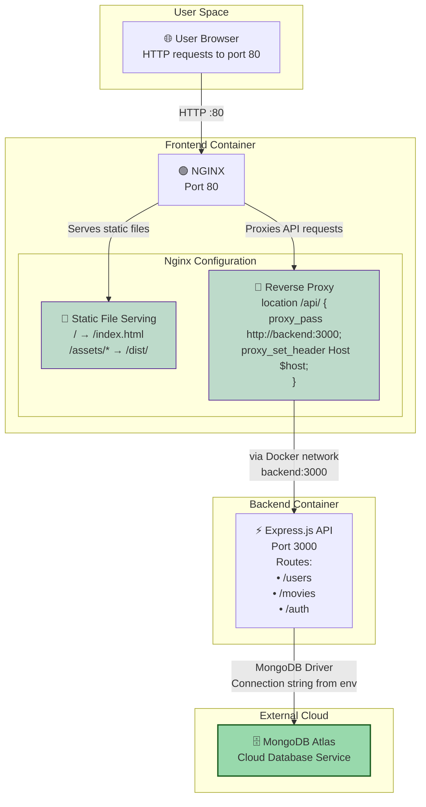

# DEV1004 - Assessment 01: Containerization of an Existing Application

## Table of Contents

1. [Application Summary](#application-summary)
2. [System Architecture](#section-1-system-architecture)
3. [Container Internal Design](#section-2-container-internal-design)
4. [Security & Secrets Management](#section-3-security--secrets-management)
5. [CI/CD Pipeline](#section-4-cicd-pipeline)
6. [How to Run](#how-to-run)

## Application Summary

A full-stack MERN application containerized with Docker, linked to an external MongoDB cloud atlas Database. Docker Images are hosted on Docker Hub.
_Runs via `docker compose up` with environment variables configured_

For detailed application specific information head to:  

- [Backend Readme](./backend/README.md)
- [Frontend Readme](./frontend/README.md)

___

## Section 1: System Architecture

### **1.1: Frontend Container**
<!-- React & Nginx (serves static files, proxies all API requests) -->
The frontend container consists of a SPA created with `React`, built with `Vite`, and served with `Nginx`. Nginx serves all of the static html, css, assets from the `./dist/` folder, and uses a proxy for all API requests. Using Nginx as an in-built web server ensures the image size remains manageable, and gives users a more reliable experience when using the container.

Nginx needs to be configured to work with the React SPA. Based on the config below, nginx will serve `index.html` for all non API-routes, enabling navigation without server-side route definitions. I will discuss the proxy settings in section 1.4:

```conf
    # Handle React Router routes explicitly - always serves the index html file allowing navigation
    location / {
        try_files $uri $uri/ /index.html;
    }

    # Proxy ALL API requests to backend explicitly
    # Include all backend routes 
    location ~ ^/(auth|friendships|leaderboard|movies|users|reel-progress) {
      proxy_pass http://backend:3000; # Manually sends requests to backend:3000 (docker container bridge)
      proxy_set_header Host $host; # Ensures the original host is preserved
      proxy_set_header X-Real-IP $remote_addr; # Sends the actual user's IP address to the backend not nginx server IP
      proxy_set_header X-Forwarded-For $proxy_add_x_forwarded_for; # Shows the nginx proxy as a pass through for transparency
      proxy_set_header X-Forwarded-Proto $scheme; # Tells the backend this was either an HTTP or HTTPS request 
    }
```

### **1.2: Backend Container**
<!-- Node.js, Express -->
The backend container uses Express as the application server, with Node.js 22 Alpine providing the runtime. Using Alpine has benefits including: smaller image size, added security and faster deployment.  Express handles the business logic, and communicates with the database. This abstracts the complex logic for greater control, functional design ensuring frontend is skinny, and added security when communicating with MongoDB.

### **1.3: MongoDB Atlas**
<!-- External cloud DB, smaller image size, db is protected -->
The database in this system is external through MongoDB Cloud Atlas. This provides greater security, as well as ensuring a smaller image size. NoSQL databases can have large file sizes (binary for image files), keeping them as external services provides a much more manageable image size.

### **1.4: Docker Network & Nginx Configuration**
<!-- port mappings, nginx proxy config go here -->
The frontend container is mapped to port 80, with Nginx acting as both a static web-serve and, a reverse proxy for API requests to `backend:3000`. This proxy configuration avoids CORS issues by explicitly keeping calls within the same origin from the browser's perspective. Docker compose creates a network bridge via Docker's internal DNS (`app-network`) enabling internal service discovery, allowing the exposed port of `backend:3000` to be resolved by the frontend.

_**Figure 1:** Full-stack container architecture showing component relationships_



## Section 2: Container Internal Design

### **2.1: Staged Builds:**

[simple flowchart of stages]

### **2.2: User Security:**

<!-- discuss the non-root users and what thsi does for security -->

### **2.3: Health Checks**


### **2.4: .dockerignore Optimization**

## Section 3: Security & Secrets Management

### **3.1: Application Auth:**

[Diagram of simple Auth token flow here]

### **3.2: Secure Environment Variables:**

[Diagram of env variable injection from github actions here]

### **3.3: Security Benefits:**

## Section 4: CI/CD Pipeline

### **4.1: GitHub Actions**

[diagram of Push actions]

[diagram of pull_request actions]

[diagram of test_secrets action]

### **4.2: Docker Hub Deployment:**

[diagram of build and push flow]

___

## How to Run

[include brief steps on how to run the application?]